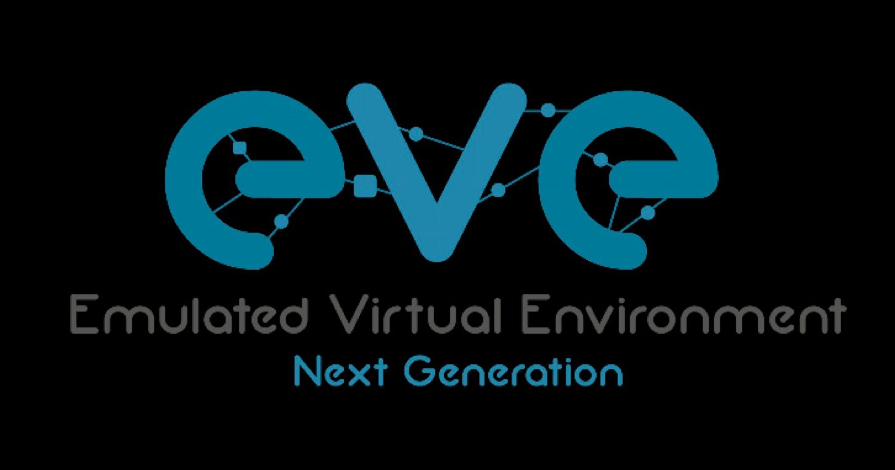
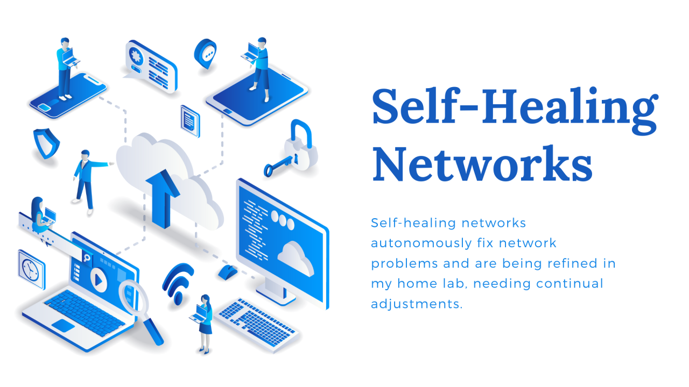
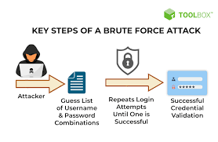
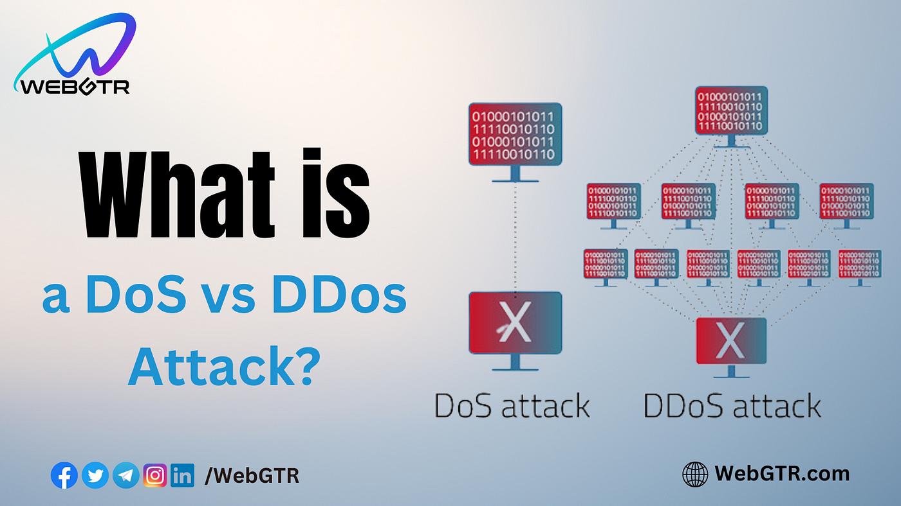
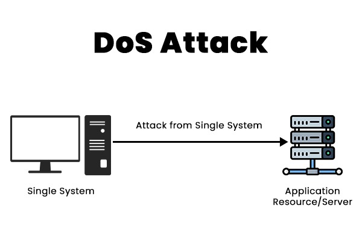
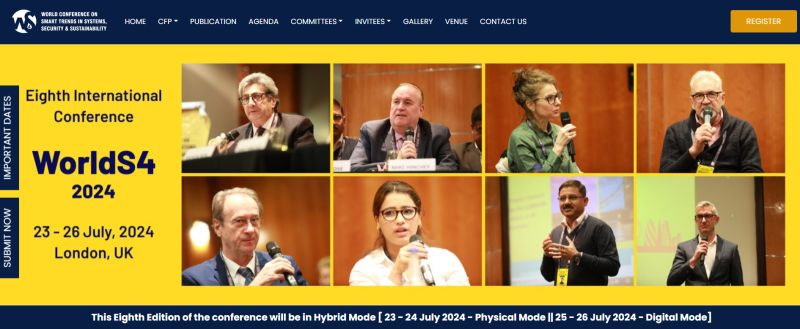

<!DOCTYPE html>
<html lang="en">
<head>
    <meta charset="utf-8">
    <meta name="viewport" content="width=device-width, initial-scale=1.0">
    <meta name="description" content="">
    <meta name="author" content="webthemez">
    <title>SecureX</title>
	<!-- core CSS -->
    <link href="css/bootstrap.min.css" rel="stylesheet">
    <link href="css/font-awesome.min.css" rel="stylesheet">
    <link href="css/animate.min.css" rel="stylesheet"> 
    <link href="css/prettyPhoto.css" rel="stylesheet">
    <link href="css/styles.css" rel="stylesheet"> 
    <!--[if lt IE 9]>
    
    
    <![endif]-->       
    <link rel="shortcut icon" href="images/ico/favicon.ico"> 
</head> 

<body id="home">
    <header id="header">
        <nav id="main-nav" class="navbar navbar-default navbar-fixed-top" role="banner">
            

                

                    <button type="button" class="navbar-toggle" data-toggle="collapse" data-target=".navbar-collapse">
                        Toggle navigation
                        
                        
                        
                    </button>
                    
                

				
                

                    <ul class="nav navbar-nav">
                        <li class="scroll active"><a href="#home">Home</a></li>  
                        

<li class="nav-item dropdown">

              <a class="nav-link dropdown-toggle" href="#" id="navbarDropdown" role="button" data-toggle="dropdown" aria-haspopup="true" aria-expanded="false">

                Project Scope

              </a>

              

                <a class="dropdown-item" href="#project-scope">Literature Survey</a>

                <a class="dropdown-item" href="#research_gap">Research Gap</a>

                <a class="dropdown-item" href="#research_problem">Research Problem & Solution</a>

                <a class="dropdown-item" href="#research_objectives">Research Objectives</a>

                <a class="dropdown-item" href="#methodology">Methodology</a>

                <a class="dropdown-item" href="#tech_used">Technologies</a>

              

            </li>				
                        <li class="scroll"><a href="#milestones">Milestones</a></li>
                        

<li class="nav-item dropdown">

                <a class="nav-link dropdown-toggle" href="#" id="navbarDropdown" role="button" data-toggle="dropdown" aria-haspopup="true" aria-expanded="false">

                  Downloads

                </a>

                

                  <a class="dropdown-item" href="#downloads">Documents</a>

                  <a class="dropdown-item" href="#presentations">Presentations</a>

                

            </li>
                        <li class="scroll"><a href="#portfolio">Gallery</a></li>
                        <li class="scroll"><a href="#our-team">About Us</a></li>
						<li class="scroll"><a href="#achievements">Achievements</a></li>
                        <li class="scroll"><a href="#contact-us">Contact Us</a></li>                        
                    </ul>
                

            
<!--/.container-->
        </nav><!--/nav-->
    </header><!--/header-->

    <section id="hero-banner">
             

                    

                        

                            

                                 
                                    
<h2>SecureX</h2>

                                    <h2 style="text-align: center;">SecureX</h2>
                                    
Network Infrastructure Management Tool  with python and Machine Learning 

                                    <a class="btn btn-primary btn-lg" href="#project-scope">Learn More</a>
                                
                            

                        

                    

                

    </section><!--/#main-slider-->

 <section id="services" >
        

            

                <h2 class="section-title wow fadeInDown">Project Scope</h2>
                
This is the component of project implementation that helps determine goals, constraints, workflow management strategies, tasks, and deliverables.

            

            <section id="project-scope" class="main-sections" style="background-color:#FDFEFE">
                

                    
                    <!-- Literature Survey -->
                    

                        <h2>Literature Survey</h2>
                        

                          

                            

                              

                                
                              

                              <!-- 
 -->
                                <!--  -->
                                    
                                
                              <!-- 
 -->
                            

                          

                          

                            
Microorganism identification in water bodies is critical for assessing water quality and potential threats to human and environmental health. Several studies have focused on exploiting microscopic pictures and image processing techniques to identify microorganisms.
                             

                           
[1]Used automated image analysis
                            techniques to classify and quantify microorganisms in
                            water samples, for example. They proved the power of
                            image processing in recognizing and distinguishing
                            different types of microorganisms, providing vital
                            insights on microbial ecology and water quality.
                            The classification of tuberculosis bacteria will examine
                            the degree of classification accuracy using two different
                            classification approaches. Using digital preparation
                            photographs, tuberculosis bacteria are classified using
                            k- nearest neighbor and backpropagation methods.
                            Single tuberculosis bacterium and multiple tuberculosis
                            bacteria are the two categories of bacteria used in this
                            method [3].  

                            
Using computer vision and machine learning
                                techniques, the classification of bacteria is being
                                computerized. In this classification, researchers have
                                looked into a method for reprogramming "Inception,"
                                one of the best open-source neural network models, to
                                classify microscopic pictures of bacteria. To
                                comprehend the distinct structure of each bacterium
                                and how it forms colonies, the network gathered
                                hundreds of features from the images for edge-
                                detection and pattern recognition. Using a dataset of
                                500 microscopic photos of bacteria, researchers were
                                able to retrain the neural network on 400 of the images
                                and test its prediction accuracy on the remaining 250.
                                Researchers ultimately discovered the ideal values of
                                the parameters to obtain the prediction accuracy of
                                almost 95% after executing numerous processes of
                                preprocessing image data, tweaking the neural
                                network, and testing its several fine-tuned versions [4].

                            

                                 
                              
<strong>References</strong>

                              <ol>
                                <li>C, Geoffrey, B. Patrick, T, Prasad, J. Thomas and B. Marvin, "Estimating chlorophyll
                                    concentration in Lake Malawi from MODIS satellite imagery." Physics and Chemistry of the
                                    Earth, 2009
                                <li> R. B. Johansen, N. Richard, N. Jakub, X. Chris, S. Min, Y. Song, L Bo and E. Hongeng
                                    Emery. "Evaluating the portability of satellite derived chlorophyll-a algorithms for temperate
                                    inland lakes using airbome hyperspectral imagery and dense surface observations," Harmful
                                    Algae, vol. 76, 2018</li>
                                <li> S. Liyanage, G. M B. S. Gajanayake, O. D. Wijewickrama, S. D. S. A Femando, D. R
                                    Wijendra and A. I. Gamage, "System to Improve the Quality of Water Resources in Sri Lanka
                                    Using Machine Leaming and Image Processing." 4th International Conference on
                                    Advancements in Compuing (ICAC 2022), 2022</li>
                              </ol>
                            

                          

                        

                    

                    <!-- Research Gap -->
                    

                      <h2>Research Gap</h2>
                      
Following areas are the research gaps found in most of the recent researches.

                      

                    

                    

                        

                            

                                
                            

                            

                                <h5>Application of Advanced Analytical Techniques </h5>
                            

                            

                                
 The research largely relies on traditional methods, such as culture techniques and manual counting, missing opportunities to leverage advanced analytical techniques, like modern technology and machine learning, for more accurate and cost-effective water quality assessment

                            

                        

                        

                            

                               
                            

                            

                                <h5>Microorganisms Identification and Classification</h5>
                            

                            

                                
While some research has automated microorganism counting, it has not addressed the crucial aspects of identifying and categorizing these microorganisms, creating a research gap in these areas for a more comprehensive understanding of water quality
                                

                            

                        

                        

                            

                               
                            

                            

                                <h5>Cost-effective Solution</h5>
                            

                            

                                
Certain research projects have proposed innovative methods but raised concerns about their potentially high costs, necessitating further research into developing economically viable solutions for water quality assessment to ensure practical application in diverse settings
                                

                            

                        

        
                    

                    
 
                      

                  

                    <!-- Research Problem -->
                    

                      <h2>Research Problem & Solution</h2>
                       

                        

                         <h5 style="color: #F9690E"><strong>Proposed Problem</strong></h5>
                          
                           
                            

                            
The research problem at hand originates from the limitations of conventional techniques for identifying microorganisms in water, which are often confined to specific species and rely on labor-intensive manual or outdated automated methods. This deficiency hinders a comprehensive understanding of the diverse array of microorganisms inhabiting water ecosystems, which is essential for assessing water quality and ecological health. To address this shortfall, the research aims to pioneer the utilization of advanced microscopic imaging technology, enabling the examination of a wide range of microorganisms with efficiency and precision. However, a novel challenge arises – the need to make this advanced technology accessible and user-friendly. The proposed web-based application is envisioned as a solution that simplifies the identification process, broadening access to researchers, educators, and enthusiasts, thus facilitating their active participation in the study of waterborne microorganisms. This dual objective seeks to advance microorganism identification while creating an inclusive tool for community involvement, ultimately promoting collaborative research and a deeper understanding of water quality, health implications, and ecological dynamics in aquatic ecosystems.

                         
                        

        
                       
                        

                      

                         

                         <h5 style="color: #F9690E"><strong>
Proposed Solution
</strong></h5>
                          
                         
The research solution entails the development of an integrated platform known as the "Blue Watch" application. This application is designed to address multiple aspects of water quality assessment and management. Firstly, it provides an intuitive interface to easily identify water quality by utilizing advanced microscopic imaging technology. Users can efficiently detect and classify microorganisms and fungi types present in water samples, enhancing our understanding of waterborne life. Additionally, the application incorporates satellite imagery analysis to determine the pollution status of water bodies, thereby serving as a vital tool for monitoring environmental health. Furthermore, it offers a predictive model for the Water Quality Index (WQI) by leveraging physical parameters of water. This model not only assesses current water quality but also forecasts the WQI for the next 12 months, facilitating proactive water resource management and environmental sustainability. The "Blue Watch" application represents a comprehensive and user-friendly solution that integrates cutting-edge technology for holistic water quality assessment and long-term monitoring.	

                        

                  

                  
                    <!-- Research Objectives -->
               

                      <h2>Research Objectives</h2>
                       

                        

                         <h5 style="color: #6b615a"><strong>Identifying microorganisms using water samples
                        </strong></h5>
                          
                           
                            

                            
In this component, the first step involves classifying microscopic images to identify microorganisms as either bacteria or protozoa. Once identified, the focus shifts to differentiating between bacteria and protozoa before proceeding with detailed classification. Subsequently, the research progresses to categorizing specific types of bacteria and protozoa, enabling differentiation and cataloging of diverse species and strains within these microorganism groups.
                            

                         
                        

						

						 

                         <h5 style="color: #6b615a"><strong>Identifying fungus types using microscopic images.
                        </strong></h5>
                          
                           
                            

                            
This component involves building a binary classification model to identify whether a microscopic image depicts a fungus or not. If the image is identified as a fungus, further analysis is conducted to specify the exact type among Aspergillus spp., Candida spp., and Mycorrhizal Fungi. Following the identification of the exact fungus type, the system produces an output indicating the fungus type and assesses its impact on the environment, classifying it as harmful or useful.
                            

                         
                        

						

						 

                         <h5 style="color: #6b615a"><strong>Identifying color of the water body using image processing techniques and detecting water quality based on satellite images</strong></h5>
                          
                           
                            

                            
The primary goal is to utilize satellite imagery in a web application to identify water body colors and assess reservoir water quality. This user-friendly platform aims to provide accessible water quality monitoring. Users can analyze satellite images to identify water bodies and evaluate their quality based on color.
                            

                         
                        

						

						 

                         <h5 style="color: #6b615a"><strong>Using the WQI to evaluate groundwater quality. </strong></h5>
                          
                           
                            

                            
The research involves a detailed analysis of Water Quality Index (WQI) and its correlation with various physical parameters like turbidity, total dissolved solids, temperature, Secchi depth, and conductivity. The study explores the complex relationships and interactions among these variables, examining their impact on overall water quality assessment. Additionally, a comprehensive predictive model for WQI is developed, incorporating a wide range of influencing variables and advanced machine learning methods to enhance accuracy. Long-term analysis spanning several decades examines historical data, identifying nuances in water quality. The research investigates the effects of factors such as climate change, urbanization, land use, pollution sources, and regulatory actions on long-term water quality trends.

                         
                        

        
                       
                        

                      

                    <!-- Methodology -->
                    

                      <h2>Methodology</h2>
                      

                        

                          

						   
                            <!-- 
 -->
                                     
                              
                              
Figure: High Level Architecture of the system.

                            <!-- 
 -->
                          

                        

                        

                          
The proposed pest and disease Surveillance system consists of 4 main components. They are;

                          <ol>
                            <li><strong>Identifying bacteria and protozoa using image processing</strong></li>
                            <li><strong>Identifying fungi using image processing</strong></li>
                            <li><strong>Deficiency Identification (Mg deficiency and Leaf Scorch Decline)</strong></li>
                            <li><strong>Water resource identification</strong></li>
                            
                          </ol>
                          
 Secure X, a sophisticated set of network infrastructure management tools designed to handle the intricacies of modern network environments. system consists of 4 main components. 

                                        Network devices bulk configuration tool
                                        Network Self-Healing Tool
                                        DDoS Attack Detection and Mitigation
                                        Brute force attack detection using machine learning

                                        Develop python configuration templates for each DHCP,ACL,NAT,VPN,SNMP,HSRP,IP SLA,NTP,AAA configuration. templates should contain placeholders for variables such as IP addresses, interface names, subnet masks, authentication credentials. Develop a Python script that reads the input data and configuration templates, then generates device-specific configuration files based on the provided parameters. Deploy the generated configuration files to the respective devices using appropriate network protocols (SSH). Continuously monitor network performance and user feedback to identify areas for improvement in the bulk configuration process.

                                        Develop scripts to gather relevant network health metrics from network devices, such as CPU and memory usage, interface status, routing table information, and device logs. Implement algorithms to automatically detect common failure scenarios (e.g., interface flapping, high CPU utilization, BGP neighbor down). Implement automated remediation actions, such as configuration changes, service restarts, failover mechanisms, or dynamic routing adjustments, to mitigate the impact of failures.

                                        Capture the network traffic using python script & create a pcap file. obtain the proposed CSE-CIC-IDS 2018 dataset benchmark dataset.prepare the data & train & evaluate the model. Develop the user interface application to upload your network packet captured file and select whatever the algorithm among three algorithms (Decision Tree , Random Forest , Support vector machine ) you prefer to detect brute force attack on ssh & ftp protocol through a drop-down list.

                                        Comparative Analysis of Machine Learning Algorithms for DDoS Attack Detection using IDS 2018 Dataset and Development of a User-friendly Interface for Real-time Detection. The algorithms that were selected are based on earlier research. focused on detecting specific attack types, namely DoS attacks (GoldenEye, Slowloris, Hulk, SlowHTTPTest) and DDoS attacks (LOIC- HTTP). The performance of each algorithm was evaluated against these attack types to provide insights into their effectiveness in real-world scenarios.

                                        Multiple network devices can be configured simultaneously with the help of the Bulk Configuration Tool, which simplifies deployment procedures and lowers mistake rates. By using clever algorithms, the Network Self-Healing Tool proactively monitors and fixes network problems, reducing downtime and improving reliability. The DDoS Attack Detection Tool ensures service availability by quickly identifying and mitigating DDoS attacks through the use of sophisticated anomaly detection techniques. By capturing the network traffic & identifying and preventing brute-force login attempts on network devices, the Machine Learning Driven Brute Force Attack Detection System  improves security.
                                        

                          <!-- 
Once the system identifies that the leaves are infected, then the response will be captured by the crowdsourcing platform. The Google Map will be updated with the real time locations (latitude and longitude) of the infected palms. In Addition, the system will automatically send notifications to the farmers and other stakeholders who are at the risk of infection.
 -->
                        

                      

                  

                    
<!--/.col-md-4-->
                

            
<!--/.row-->    
        
<!--/.container-->
    </section><!--/#services-->
	
	   <section id="tech_used">
       <!-- Technologies Used -->

    <h2>Technologies and Tools Used</h2>
    

    

    

    
    

    
Python

    

    

    

    
    

    
React

    

    

    

    
    

    
Tensorflow

    

    

    

    
    

    
Keras

    

    

    

    
    

    
Google Colab

    

    

    

    
    

    
Google Cloud

    

    

    

    
    

    
VS Code

    

    

    

    
    

    
Flask

    

    

    

    
    

    
Git Lab

    

    

    

    
    

    
Stat Models

    

    

    

    
    

    
Numpy

    

    

    

    </section><!--/#our-team-->

    <!-- Milestones -->
    <section id="milestones" class="sub-section" >
        

            

                <h2 class="section-title wow fadeInDown">Milestones</h2>
                
            

            

                <h2>Timeline in Brief</h2>
                

                  <ul class="timeline">
                    <!-- Project Proposal -->
                    <li class="timeline-event">
                      <label class="timeline-event-icon"></label>
                      

                        
July 2023

                        <h3>Project Proposal</h3>
                        
A Project Proposal is presented to potential sponsors or clients to receive funding or get your project approved.

                        
<strong>Marks Allocated : </strong>12

                        

                          
12%

                        

                      

                    </li>
                    <!-- Progress Presentation I -->
                    <li class="timeline-event">
                      <label class="timeline-event-icon"></label>
                      

                        
November 2023

                        <h3>Progress Presentation I</h3>
                        
Progress Presentation I reviews the 50% completetion status of the project. This reveals any gaps or inconsistencies in the design/requirements.

                        
<strong>Marks Allocated : </strong>15

                        

                          <!-- 

 -->
                          
27%

                        

                      

                    </li>
                    <!-- Research Paper -->
                    <li class="timeline-event">
                      <label class="timeline-event-icon"></label>
                      

                        
July 2024

                        <h3>Research Paper</h3>
                        
Describes what you contribute to existing knowledge, giving due recognition to all work that you referred in making new knowledge

                        
<strong>Marks Allocated : </strong>10

                        

                          <!-- 

 -->
                          
37%

                        

                      

                    </li>
                    <!-- Progress Presentation II -->
                    <li class="timeline-event">
                      <label class="timeline-event-icon"></label>
                      

                        
July 2024

                        <h3>Progress Presentation II</h3>
                        
Progress Presentation II reviews the 90% completetion status demonstration of the project. Along with a Poster presesntation which describes the project as a whole.

                        
<strong>Marks Allocated : </strong>18

                        

                          <!-- 

 -->
                          
55%

                        

                      

                    </li>
                    <!-- Website -->
                    <li class="timeline-event">
                      <label class="timeline-event-icon"></label>
                      

                        
June 2024

                        <h3>Website Assessment</h3>
                        
The Website helps to promote our research project and reveals all details related to the project.

                        
<strong>Marks Allocated : </strong>2

                        

                          <!-- 

 -->
                          
57%

                        

                      

                    </li>
                    <!-- Logbook -->
                    <li class="timeline-event">
                      <label class="timeline-event-icon"></label>
                      

                        
July 2024

                        <h3>Logbook and Progress Reports</h3>
                        
Status of the project is validated through the Logbook. This also includes, Status documents 1 & 2.

                        
<strong>Marks Allocated : </strong>4

                        

                          <!-- 

 -->
                          
61%

                        

                      

                    </li>
                    <!-- Final Report -->
                    <li class="timeline-event">
                      <label class="timeline-event-icon"></label>
                      

                        
May 2024

                        <h3>Final Report</h3>
                        
Final Report evalutes the completed project done throughout the year. Marks mentioned below includes marks for Individual & group reports and also Final report.

                        
<strong>Marks Allocated : </strong>19

                        

                          <!-- 

 -->
                          
80%

                        

                      

                    </li>
                    <!-- Viva -->
                    <li class="timeline-event">
                      <label class="timeline-event-icon"></label>
                      

                        
May 2024

                        <h3>Final Presentation & Viva</h3>
                        
Viva is held individually to assess each members contribution to the project.

                        
<strong>Marks Allocated : </strong>20

                        

                          <!-- 

 -->
                          
100%

                        

                      

                    </li>
                  </ul>
                

            

        

      </section>
	  
	  
	  
	  <!-- Downloads -->
      <section id="downloads" class="main-sections" >
        

            <h5 class="section-headings">Downloads</h5>
            <!-- Documents -->
            

                <h2>Documents</h2>
                
Please find all documents related to this project below.

                                  <!-- Final Report -->
                  

                    

                      

                        <h5 class="card-title"><i class="fas fa-file-pdf mr-2 download-pdf"></i>Status Docs</h5>
                        
It20631338

                      

                      <ul class="download-items list-group list-group-flush">
                        <li class="list-group-item">Status Doc 1 &nbsp;&nbsp;<a href="https://drive.google.com/file/d/1XbTD6TE5DDd8WJrfQCh6jfGfWo9e7OTB/view?usp=sharing" target="_blank">Download</a></li>
                        <li class="list-group-item">Status Doc 2&nbsp;&nbsp;<a href="https://drive.google.com/file/d/1o9mKgdGM9MAEd_5_OfaSjT0FlT4eB6Nm/view?usp=sharing" target="_blank">Download</a></li>
                      </ul>

                    

                  

                                  <!-- Final Report -->
                  

                    

                      

                        <h5 class="card-title"><i class="fas fa-file-pdf mr-2 download-pdf"></i>Status Docs</h5>
                        
It20301668

                      

                      <ul class="download-items list-group list-group-flush">
                        <li class="list-group-item">Status Doc 1 &nbsp;&nbsp;<a href="https://docs.google.com/document/d/1PXUaXCQt4BIPbb9-GwCUvViuVu2a6B6P/edit?usp=sharing&ouid=101317423239018164131&rtpof=true&sd=true" target="_blank">Download</a></li>
                        <li class="list-group-item">Status Doc 2&nbsp;&nbsp;<a href="https://docs.google.com/document/d/1PXUaXCQt4BIPbb9-GwCUvViuVu2a6B6P/edit?usp=sharing&ouid=101317423239018164131&rtpof=true&sd=true" target="_blank">Download</a></li>
                      </ul>
                    

                  

                                    

                    

                      

                        <h5 class="card-title"><i class="fas fa-file-pdf mr-2 download-pdf"></i>Status Docs</h5>
                        
It20627928

                      

                      <ul class="download-items list-group list-group-flush">
                        <li class="list-group-item">Status Doc 1 &nbsp;&nbsp;<a href="https://drive.google.com/file/d/1vdkE6-mqBFKfHCdTKy-k9wIkYsUtonhS/view?usp=sharing" target="_blank">Download</a></li>
                        <li class="list-group-item">Status Doc 2&nbsp;&nbsp;<a href="https://drive.google.com/file/d/1jeHBMTYoUn6mXJutB77v3OnUr2gnSyvZ/view?usp=sharing" target="_blank">Download</a></li>
                      </ul>
                    

                  

                                      

                    

                      

                        <h5 class="card-title"><i class="fas fa-file-pdf mr-2 download-pdf"></i>Status Docs</h5>
                        
It20623036

                      

                      <ul class="download-items list-group list-group-flush">
                        <li class="list-group-item">Status Doc 1 &nbsp;&nbsp;<a href="https://drive.google.com/file/d/1o9mKgdGM9MAEd_5_OfaSjT0FlT4eB6Nm/view?usp=sharing" target="_blank">Download</a></li>
                        <li class="list-group-item">Status Doc 2&nbsp;&nbsp;<a href="https://drive.google.com/file/d/1o9mKgdGM9MAEd_5_OfaSjT0FlT4eB6Nm/view?usp=sharing" target="_blank">Download</a></li>
                      </ul>
                    

                  

                  

                    

                      

                        <h5 class="card-title"><i class="fas fa-file-pdf mr-2 download-pdf"></i>Research Paper</h5>
                        
Submitted on 2024/03/04

                      

                      <ul class="download-items list-group list-group-flush">
                        <li class="list-group-item">&nbsp;&nbsp;<a href="https://drive.google.com/file/d/1ki5wUR8soabJJIumBkenpeGSBkcc0VgM/view?usp=sharing" target="_blank">Download</a></li>
                      </ul>

                    

                  

                  

                    

                      

                        <h5 class="card-title"><i class="fas fa-file-pdf mr-2 download-pdf"></i>Final Report</h5>
                        
Submitted on 2024/04/05

                      

                      <ul class="download-items list-group list-group-flush">
                        <li class="list-group-item">It20627928 &nbsp;&nbsp;<a href="https://drive.google.com/file/d/1ZpmxfVvxZY0Sf5b-d1iwmX5pXWS40Dc-/view?usp=sharing" target="_blank">Download</a></li>
                        <li class="list-group-item">It20623036&nbsp;&nbsp;<a href="https://drive.google.com/file/d/1ZpmxfVvxZY0Sf5b-d1iwmX5pXWS40Dc-/view?usp=sharing" target="_blank">Download</a></li>
                      </ul>

                    

                  

                  

                    

                      

                        <h5 class="card-title"><i class="fas fa-file-pdf mr-2 download-pdf"></i>Final Report</h5>
                        
Submitted on 2024/04/05

                      

                      <ul class="download-items list-group list-group-flush">
                        <li class="list-group-item">It20631338 &nbsp;&nbsp;<a href="https://drive.google.com/file/d/1ZpmxfVvxZY0Sf5b-d1iwmX5pXWS40Dc-/view?usp=sharing" target="_blank">Download</a></li>
                        <li class="list-group-item">It20301668&nbsp;&nbsp;<a href="https://drive.google.com/file/d/1ZpmxfVvxZY0Sf5b-d1iwmX5pXWS40Dc-/view?usp=sharing" target="_blank">Download</a></li>
                      </ul>

                    

                  

                  
                

            

            <!-- Presentations -->
            

                <h2>Presentations</h2>
                
Please find all presentations related this project below.

                

                  <!-- Project Proposal -->
                  

                    

                      

                        <h5 class="card-title"><i class="fas fa-file-powerpoint mr-2 download-powerpoint"></i></i>Project Proposal</h5>
                        
Submitted on 2023/03/27

                      

                      <ul class="download-items list-group list-group-flush">
                        <li class="list-group-item">Group &nbsp;<a href="https://docs.google.com/presentation/d/1lRogfCdGfI44H_P1JQuYkeKwQlgeD8hn/edit?usp=sharing&ouid=101317423239018164131&rtpof=true&sd=true" target="_blank">Download</a></li>
                      </ul>
                    

                  

                  <!-- Progress Presentation I -->
                  

                    

                      

                        <h5 class="card-title"><i class="fas fa-file-powerpoint mr-2 download-powerpoint"></i></i>Progress Presentation I</h5>
                        
Submitted on 2023/05/22

                      

                      <ul class="download-items list-group list-group-flush">
                        <li class="list-group-item">Group &nbsp;<a href="https://docs.google.com/presentation/d/1lRogfCdGfI44H_P1JQuYkeKwQlgeD8hn/edit?usp=sharing&ouid=101317423239018164131&rtpof=true&sd=true" target="_blank">Download</a></li>
                      </ul>
                    

                  

                  <!-- Progress Presentation II -->
                  

                    

                      

                        <h5 class="card-title"><i class="fas fa-file-powerpoint mr-2 download-powerpoint"></i></i>Progress Presentation II</h5>
                        
Submitted on 2023/09/04

                      

                      <ul class="download-items list-group list-group-flush">
                        <li class="list-group-item">Group &nbsp;<a href="https://docs.google.com/presentation/d/1lRogfCdGfI44H_P1JQuYkeKwQlgeD8hn/edit?usp=sharing&ouid=101317423239018164131&rtpof=true&sd=true" target="_blank">Download</a></li>
                      </ul>
                    

                  

                  <!-- Final Presentation -->
                  

                    

                      

                        <h5 class="card-title"><i class="fas fa-file-powerpoint mr-2 download-powerpoint"></i></i>Final Presentation</h5>
                        
Submitted on 2023/10/31

                      

                      <ul class="download-items list-group list-group-flush">
                        <li class="list-group-item">Group &nbsp;<a href="https://docs.google.com/presentation/d/1lRogfCdGfI44H_P1JQuYkeKwQlgeD8hn/edit?usp=sharing&ouid=101317423239018164131&rtpof=true&sd=true" target="_blank">Download</a></li>
                      </ul>
                    

                  

                

            

        

      </section>

  

  

  <section id="portfolio">
        

            

                <h2 class="section-title wow fadeInDown">Gallery</h2>
                
Network Infrastructure Management Tool.

            

            

                <ul class="portfolio-filter" style="display:none">
                    <li><a class="active" href="#" data-filter="*">All Works</a></li>
                    <li><a href="#" data-filter=".designing">Designing</a></li>
                    <li><a href="#" data-filter=".mobile">Mobile App</a></li>
                    <li><a href="#" data-filter=".development">Development</a></li>
                </ul><!--/#portfolio-filter-->
            

            

                

                    

                        
                        
 
                            <a class="preview" href="images/portfolio/01.jpg" rel="prettyPhoto"><i class="fa fa-eye"></i></a>
                        

                    

                
<!--/.portfolio-item-->

                

                    

                        
                        
 
                            <a class="preview" href="images/portfolio/02.jpg" rel="prettyPhoto"><i class="fa fa-eye"></i></a>
                        

                    

                
<!--/.portfolio-item-->

                

                    

                        
                        
 
                            <a class="preview" href="images/portfolio/03.jpg" rel="prettyPhoto"><i class="fa fa-eye"></i></a>
                        

                    

                
<!--/.portfolio-item-->

                

                    

                        
                        
 
                            <a class="preview" href="images/portfolio/04.jpg" rel="prettyPhoto"><i class="fa fa-eye"></i></a>
                        

                    

                
<!--/.portfolio-item-->

                

                    

                        
                        
 
                            <a class="preview" href="images/portfolio/05.jpg" rel="prettyPhoto"><i class="fa fa-eye"></i></a>
                        

                    

                
<!--/.portfolio-item-->

                

                    

                        
                        
 
                            <a class="preview" href="images/portfolio/06.jpg" rel="prettyPhoto"><i class="fa fa-eye"></i></a>
                        

                    

                
<!--/.portfolio-item-->

                

                    

                        
                        
 
                            <a class="preview" href="images/portfolio/07.jpg" rel="prettyPhoto"><i class="fa fa-eye"></i></a>
                        

                    

                
<!--/.portfolio-item-->

                

                    

                        
                        
 
                            <a class="preview" href="images/portfolio/08.jpg" rel="prettyPhoto"><i class="fa fa-eye"></i></a>
                        

                    

                
<!--/.portfolio-item-->
            

        
<!--/.container-->
    </section><!--/#portfolio-->

   	<section id="our-team">
        

            

                <h2 class="section-title wow fadeInDown">
OUR TEAM MEMBERS
</h2>

            

			
			 	
            

                

                    

                        

                            
                        

                        

                            <h3>Dharmapriya N.M </h3>
							IT20631338​ 
                             (Leader) 
                        
 
                       
                    

                

                

                    

                        

                            
                        

                        

                            <h3>S N Denakumbura​</h3>
                            IT20301668​ 
                        
 
                       
                    

                

                

                    

                        

                            
                        

                        

                            <h3>H M T D Herath</h3>
                            IT20627928​ 
                        
 
                       
                    

                

                

                    

                        

                            
                        

                        

                            <h3>Jayashan H.S.P.C</h3>
                            IT20623036 
                        
 
                        
                    

                

            

        

    </section><!--/#our-team-->
   

   <!-- Achievements -->
	   <section id="achievements" class="main-sections" >
        

        

                <h2 class="section-title wow fadeInDown">
Achievements
</h2>

            

                  

                    

                      
                    

                  

				  

				  
				 
 We are excited to announce that we have submitted our research paper for consideration at the prestigious 'WorldS4 UK 2024' (World Conference on Smart Trends in Systems, Security and Sustainability). Our paper explores cutting-edge developments and insights in the field of computing and aligns with the conference's mission to advance the frontiers of knowledge. We eagerly anticipate the opportunity to present our research at WorldS4 UK 2024, where we can engage with leading experts and contribute to the vibrant exchange of ideas in the world of computing.

                

        

      </section>
   

  
   
    <section id="contact-us">
        

            

                <h2 class="section-title wow fadeInDown">Contact Us</h2>
                
Get In Touch With Us   We Are Here to Provide The Best Service For You

            

        

    </section><!--/#contact-us-->

    <section id="contact">
        
        

            

                

				  

                        

                            <h3>Contact Info</h3>

                                
                              
                            </address>
					

                    

                        

                       
                            <form id="main-contact-form" name="contact-form" method="post" action="#">
                                

                                    <input type="text" name="name" class="form-control" placeholder="Name" required>
                                

                                

                                    <input type="email" name="email" class="form-control" placeholder="Email" required>
                                

                                

                                    <input type="text" name="subject" class="form-control" placeholder="Subject" required>
                                

                                

                                    <textarea name="message" class="form-control" rows="8" placeholder="Message" required></textarea>
                                

                                <button type="submit" class="btn btn-primary">Send Message</button>
                            </form>
                        

                    

                

            

        
   
   </section><!--/#bottom-->

    <footer id="footer">
        

            

                

                    &copy; 2023 SECUREX 
                

                

                    <ul class="social-icons">
                        <li><a href="#"><i class="fa fa-facebook"></i></a></li>
                        <li><a href="#"><i class="fa fa-twitter"></i></a></li>
                        <li><a href="#"><i class="fa fa-google-plus"></i></a></li>
                        <li><a href="#"><i class="fa fa-linkedin"></i></a></li> 
                        <li><a href="#"><i class="fa fa-youtube"></i></a></li>
                        <li><a href="#"><i class="fa fa-github"></i></a></li>
                    </ul>
                

            

        

    </footer><!--/#footer-->

    
     
    
    
    
    
    
    
    
</body>
</html>
